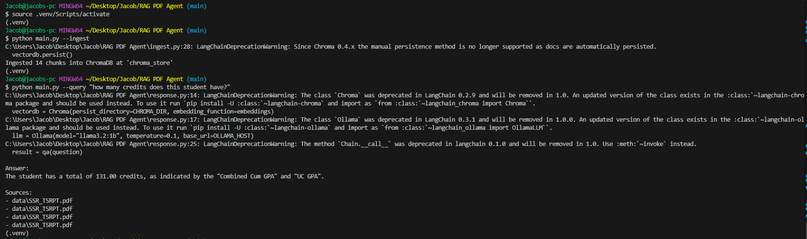

# Resume/Transcript RAG Agent
This is a prototype RAG agent that aims to answer basic questions about a student's
grades, coursework or other experiences.

## Setup
1. Initialize your virtual environment 

```bash
python -m venv .venv
source .venv/Scripts/activate
```

2. Once your virtual environment (.venv) is created, activate it
```bash
source .venv/Scripts/activate 
```

3. Install the pip packages
```bash
pip install -r requirements.txt
```

## Using the agent
Run these commands to query responses to the agent
```bash
python main.py --ingest
python main.py --response "your question"
```

## Sample Usage
